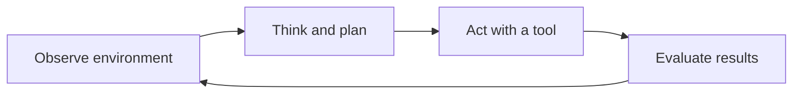

# Agentic AI Execution Loop

An AI agent operates through a continuous feedback loop: it observes its environment, decides what to do, acts through an available tool, and evaluates the result. The outcome becomes part of the next observation.



## 1. Observe the Environment

The agent gathers the information needed to understand its current situation.

Inputs can include:

- The user's goal and constraints
- Application or environment state
- Results returned by previous tool calls
- Relevant short-term and long-term memory
- Errors, warnings, and external events
- Remaining time, cost, and permission limits

An observation should be converted into structured state where possible. Structured state is easier to validate and use than an unorganized conversation transcript.

## 2. Think and Plan

The agent interprets the current state and selects the next useful action.

Planning involves:

- Comparing the current state with the desired outcome
- Identifying missing information
- Selecting an appropriate tool or subtask
- Ordering dependent actions
- Considering risk, cost, and reversibility
- Deciding whether to continue, ask for approval, or stop

The plan does not always need to cover the entire task. A short plan for the next verifiable step is often more reliable because later decisions can use fresh observations.

## 3. Act With a Tool

The agent executes a concrete action that can change or inspect the environment.

Examples include:

- Querying an API or database
- Searching documentation
- Reading or editing a file
- Running code or tests
- Sending a message
- Delegating a bounded task to another agent

Tool calls should use validated inputs, least-privilege permissions, explicit timeouts, and clear error handling. Actions with significant or irreversible effects should require human approval.

## 4. Evaluate the Results

The agent determines whether the action moved the task toward completion.

Evaluation should answer:

- Did the tool call succeed technically?
- Is the result correct and relevant?
- Does independent evidence confirm the result?
- Did the environment change as expected?
- Is another action required?
- Should the agent retry, revise the plan, escalate, or stop?

Execution success is not the same as task success. For example, a command can exit successfully while producing the wrong artifact. Evaluation must compare the observed result with explicit success criteria.

## Loop Control

The loop needs defined exit conditions. Without them, an agent can repeat actions indefinitely, waste resources, or amplify an error.

The agent should stop when:

- The goal and its acceptance criteria are satisfied
- The user cancels or changes the task
- A required approval is denied
- A retry, time, token, or cost limit is reached
- Progress is blocked by missing information or unavailable capabilities
- Continuing would violate a safety or permission boundary

A practical control model is:

```text
while goal_not_satisfied and within_limits:
    state = observe()
    next_action = plan(state)
    result = act(next_action)
    evaluation = evaluate(result, success_criteria)
    update_state(evaluation)
```

## Example: Research Agent

Suppose an agent must compare two technical libraries.

| Stage | Example behavior |
| --- | --- |
| Observe | Read the comparison criteria and inspect the available project context. |
| Think / Plan | Decide to consult official documentation for compatibility, maintenance, and licensing facts. |
| Act | Search the documentation and collect relevant evidence. |
| Evaluate | Check source quality, resolve conflicting claims, and identify unanswered criteria. |
| Repeat or stop | Continue for missing evidence or return the comparison when every criterion is supported. |

## Common Failure Modes

- **Incomplete observation:** The agent acts before gathering essential constraints.
- **Overplanning:** The agent creates a long plan that becomes stale after the first action.
- **Wrong tool selection:** The chosen tool cannot provide authoritative or current evidence.
- **Unvalidated action:** The agent assumes a successful tool call means the goal is complete.
- **Repeated failure:** The agent retries the same action without changing its approach.
- **State drift:** The agent loses track of the original goal or previously established facts.
- **Missing stop condition:** The loop continues after success or when further progress is impossible.

## Design Checklist

- Define the goal and measurable success criteria.
- Represent observations and intermediate state explicitly.
- Give each tool a narrow purpose and a clear input/output contract.
- Validate tool inputs before execution and outputs afterward.
- Require approval for sensitive or irreversible operations.
- Set retry, cost, time, and iteration limits.
- Record actions and outcomes for debugging and observability.
- Provide a clear path for stopping or escalating to a human.

## Key Takeaway

The execution loop is what makes an agent adaptive rather than a fixed sequence of prompts. Reliability comes from grounding every new decision in observed results, validating progress against explicit criteria, and enforcing clear operational boundaries.
