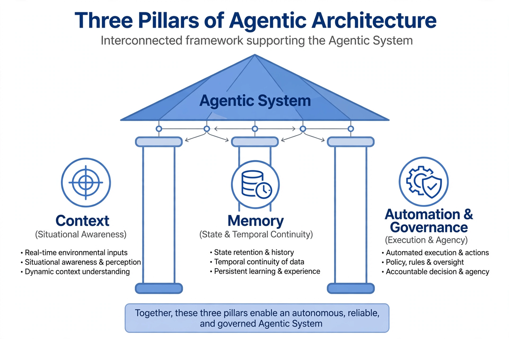
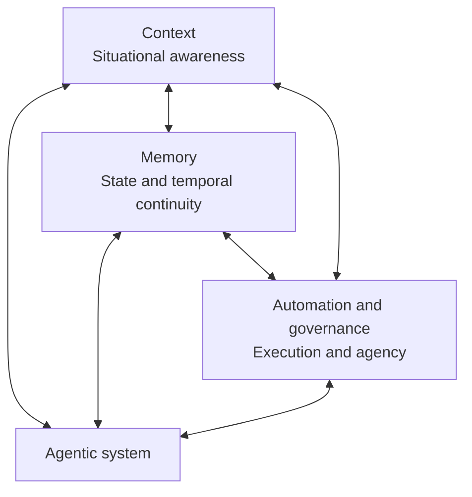

# Three Pillars of Agentic Architecture

A useful way to reason about an agentic system is through three interconnected capabilities: **context**, **memory**, and **automation with governance**. Together, they help an agent understand its situation, preserve continuity, and take controlled action.

This is a conceptual model rather than a universal industry standard. Real systems may divide these responsibilities differently, but each capability still needs an explicit owner.



Text-rendered version:



## 1. Context: Situational Awareness

Context is the information available to the agent for its current decision. It connects the agent to the present environment.

Context can include:

- The user's current request and constraints
- Recent conversation and tool results
- Application, task, and environment state
- Retrieved documents or records
- Available tools and their permissions
- Time, cost, policy, and safety limits

Good context is relevant, current, and bounded. Supplying every available fact can increase cost and distract the model from the task. Context management should select the smallest trustworthy set of information needed for the next decision.

### Context Responsibilities

- Collect real-time inputs from the environment.
- Filter and rank information by relevance.
- Represent state in a format the agent can interpret.
- Track the source and freshness of important facts.
- Remove or protect information the agent is not allowed to access.

## 2. Memory: State and Temporal Continuity

Memory preserves useful information beyond the immediate observation. It gives the system continuity across steps, tasks, or sessions.

Memory may include:

- Working state for the current task
- A history of actions and observations
- User-approved preferences
- Summaries of previous interactions
- Retrieved domain knowledge
- Learned outcomes from completed work

Memory is not simply a complete transcript. Effective memory systems decide what to store, how long to retain it, how to retrieve it, and when to update or delete it.

### Memory Responsibilities

- Retain state required by later steps.
- Preserve temporal order and provenance.
- Retrieve information relevant to the current goal.
- Resolve stale or conflicting records.
- Enforce retention, privacy, and access policies.

## 3. Automation and Governance: Execution and Agency

Automation gives the agent the ability to act. Governance constrains that ability so actions remain authorized, observable, and accountable.

This pillar includes:

- Tool and API execution
- Workflow orchestration
- Authentication and authorization
- Policy and safety checks
- Human approval gates
- Rate, time, cost, and retry limits
- Logging, tracing, and audit records
- Rollback and recovery mechanisms

Automation without governance can create unacceptable risk. Governance without useful automation produces a system that can recommend actions but cannot complete meaningful work. They should be designed together.

### Automation and Governance Responsibilities

- Validate tool inputs and outputs.
- Apply least-privilege access.
- Require approval for sensitive or irreversible actions.
- Make repeated actions safe where possible.
- Record who or what initiated each action.
- Verify outcomes before declaring a task complete.

## How the Pillars Interact

The three pillars form a feedback system rather than independent layers.

1. **Context informs action.** Current observations determine which action is appropriate.
2. **Memory enriches context.** Relevant history helps the agent avoid repeating work and maintain continuity.
3. **Actions change context.** Tool results update the environment and become new observations.
4. **Governance uses context and memory.** Policy decisions may depend on the current operation, prior approvals, and accumulated risk.
5. **Evaluation updates memory.** Verified outcomes can be retained for later tasks, while temporary details can expire.

The agentic execution loop coordinates these interactions:

```text
context + relevant memory
          |
          v
      decide next action
          |
          v
 governed tool execution
          |
          v
 evaluate result and update state
```

## Example: Support Resolution Agent

Consider an agent that investigates a customer's failed order.

| Pillar | Example behavior |
| --- | --- |
| Context | Reads the current request, order status, service health, and available support tools. |
| Memory | Retrieves earlier troubleshooting steps and records the investigation state. |
| Automation | Queries the order service and prepares a permitted corrective action. |
| Governance | Redacts sensitive data, checks authorization, and requires approval before issuing a refund. |

The task succeeds only when all three pillars cooperate. Missing context can produce the wrong diagnosis, missing memory can repeat failed steps, and missing governance can allow an unsafe action.

## Common Failure Modes

- **Context overload:** Too much irrelevant information obscures the current objective.
- **Stale context:** The agent acts on information that no longer reflects the environment.
- **Memory pollution:** Incorrect or low-value information is retained and later treated as fact.
- **Retrieval failure:** Relevant memory exists but is not selected for the current decision.
- **Excessive agency:** Tools permit actions broader than the task requires.
- **Weak oversight:** Sensitive operations occur without policy checks or approval.
- **Poor auditability:** The system cannot explain which inputs and actions produced an outcome.
- **Disconnected controls:** Governance rules do not receive enough context to make accurate decisions.

## Design Checklist

### Context

- What information is required for the next decision?
- How are source, freshness, and trust represented?
- How is irrelevant or unauthorized information excluded?

### Memory

- What should be stored, summarized, expired, or deleted?
- How is relevant memory retrieved and verified?
- How are privacy, provenance, and conflicting records handled?

### Automation and Governance

- Which actions may the agent execute directly?
- Which actions require confirmation or human approval?
- How are limits, retries, failures, and rollbacks handled?
- Are decisions and tool calls observable and auditable?

## Key Takeaway

An agentic system needs more than a capable model. Context supplies situational awareness, memory supplies continuity, and governed automation supplies controlled agency. Reliability depends on clear boundaries and trustworthy information flows between all three.
